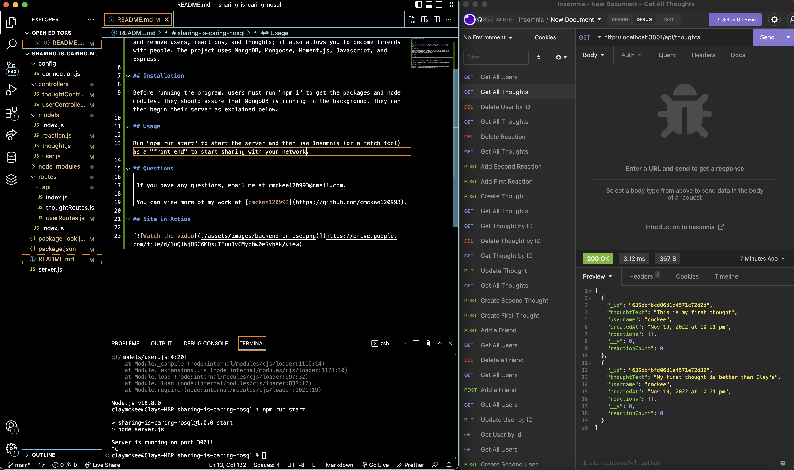

# sharing-is-caring-nosql

## Description

Sharing Is Caring is a social media site that allows users to become friends, post thoughts, and then react to thoughts via comments. The project is just an api social network (running through Insomnia). It allows you to create, update, and remove users, reactions, and thoughts; it also allows you to become friends with people. The project uses MongoDB, Mongoose, Moment.js, Javascript, and Express. 

## Installation

Before running the program, users must run "npm i" to get the packages and node modules. They should assure that MongoDB is running in the background. They can then begin their server as explained below.

## Usage

Run "npm run start" to start the server and then use Insomnia (or a fetch tool) as a "front end" to start sharing with your network.

## Questions 

 If you have any questions, email me at cmckee120993@gmail.com. 

 You can view more of my work at [cmckee120993](https://github.com/cmckee120993).

## Site in Action

Click on the screenshot above to be taken to a video recording of this project in action.